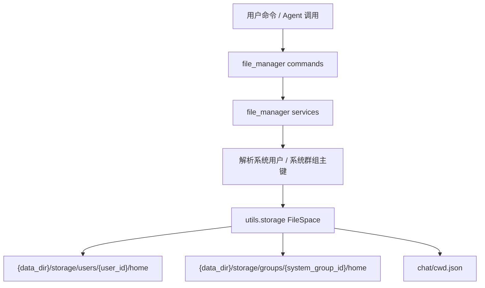

# 文件管理插件

文件管理插件负责为个人用户和群组提供隔离的文件空间。实际存储根目录来自 `utils.config.data_dir`，最终结构固定为 `{data_dir}/storage`。

## 目录结构

```text
{data_dir}/storage/
├── public/
├── groups/
│   └── {group_id}/
│       ├── chat/
│       └── home/
│           ├── documents/
│           ├── videos/
│           ├── images/
│           └── audio/
└── users/
    └── {user_id}/
        ├── chat/
        └── home/
            ├── documents/
            ├── videos/
            ├── images/
            └── audio/
```

## 路径规则

- 私聊默认进入 `users/{系统用户ID}/home`。
- 群聊默认进入 `groups/{系统群组ID}/home`。
- 这里的 `系统群组ID` 指项目数据库中的 `Group.id`，不是平台原始群号、频道号，也不是 `GroupBind.id`。
- 平台 `channel_id` / `group_id` 只用于先解析或创建系统群组绑定，不能直接作为群文件空间目录名。
- 命令中展示的 `~` 就是当前文件空间的 `home` 目录。
- `chat` 用于存放会话记录和当前工作目录状态，普通文件命令不能访问它。
- 所有路径都会经过安全解析，`../`、绝对路径、Windows 盘符等都不能越过当前 `home`。
- `cd ..` 在 `~` 下会继续停留在 `~`，不会进入其他用户或群组目录。

## 命令

- `pwd`: 查看当前路径。
- `ls [路径]`: 列出文件或目录。
- `cd [路径]`: 切换目录。
- `mkdir <路径>`: 创建目录。
- `touch <路径>`: 创建空文件；如果文件已存在，不会修改它。
- `rm [-r] [-f] <路径...>`: 删除文件；删除目录必须显式使用 `-r`。
- `cat <路径>`: 查看文本文件内容，最多展示前 4096 字节。
- `上传文件 [目标目录] <附件...>`: 保存消息附件，目标目录默认是当前路径。

## 维护说明

- `utils.storage` 是核心隔离文件空间层，不依赖 NoneBot，适合被后台管理、Agent service handler 和测试复用。
- `src/plugins/file_manager/commands.py` 只放命令声明和统一命令元数据。
- `src/plugins/file_manager/__init__.py` 只放 matcher handler。
- `src/plugins/file_manager/services.py` 放命令层服务、附件提取、Agent service handler 和展示渲染。


