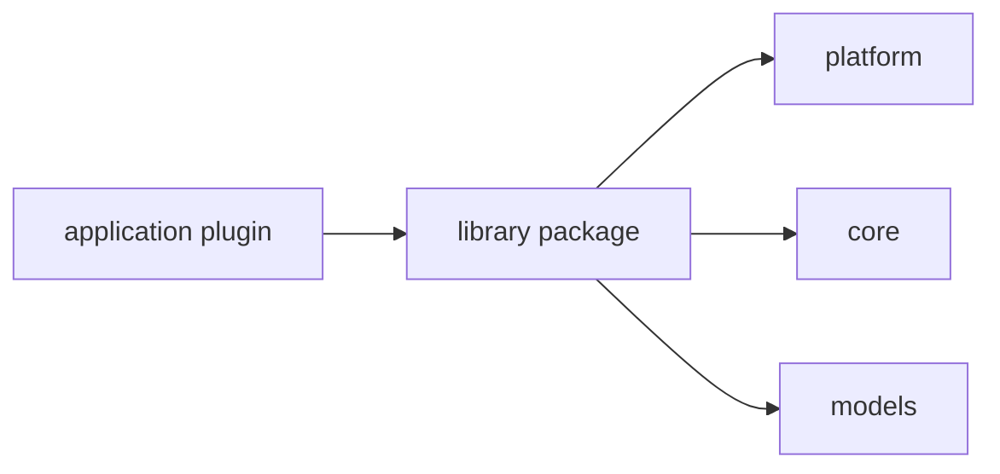

# library 能力库

`library` 放给其他应用插件复用的能力模块。这里可以定义依赖 NoneBot 类型的能力函数，但不注册 matcher、命令或运行时 hook，也不会加入 NoneBot 的 `plugin_dirs` 自动加载。

应用插件需要这些能力时，应显式从 `src.plugins.library.<name>` 导入。这样可以避免能力库与主动/被动应用插件同名时被 NoneBot 去重，导致真正的入口插件没有稳定加载。



## 放什么

- 当前事件到系统用户的身份解析与注入。
- 消息历史解析、归档函数、查询服务和 `MessageHistory` facade。
- 文件空间、群组空间、平台绑定这类可复用解析能力。
- 多个应用插件都会用到的 provider、resolver、guard。

## 不放什么

- `on_message`、`on_agent_command`、`on_alconna`、`on_command` 等 matcher 入口。
- 面向用户的大型命令体验。
- 需要 NoneBot 自动加载的插件入口。
- Agent、LLM、Storage 的核心实现。
- 纯工具函数。

## 推荐结构

```text
<library_plugin>/
├── __init__.py
├── README.md
├── providers.py
├── resolvers.py
├── services.py
├── schemas.py
└── hooks.py
```

## 例子

- `identity`：把平台事件解析成系统用户、角色和身份上下文。
- `message_history`：提供消息解析、归档函数和历史查询 facade；采集入口在 `application/passive/message_history_collector`，查询命令在 `application/active/message_history`。
- `file_scope`：解析用户、群组、班级、学院、学校文件可见范围。
