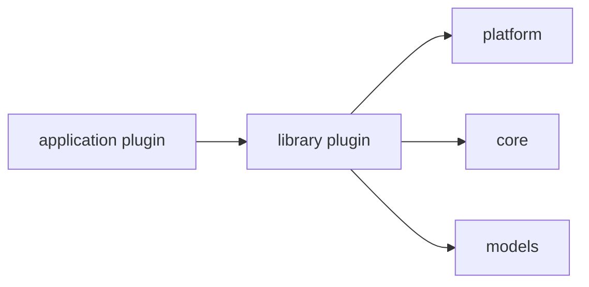

# library 能力插件

`library` 放给其他插件复用的 NoneBot 能力插件。这里的模块可以依赖 NoneBot 事件、生命周期和 Depends，但它们不直接承载完整用户业务。



## 放什么

- 当前事件到系统用户的身份解析与注入。
- 消息历史采集、归档和 `MessageHistory` facade。
- 文件空间、群组空间、平台绑定这类可复用解析能力。
- 多个应用插件都会用到的 provider、resolver、guard。

## 不放什么

- 面向用户的大型命令体验。
- Agent、LLM、Storage 的核心实现。
- 纯工具函数。

## 推荐结构

```text
<library_plugin>/
├── __init__.py
├── README.md
├── providers.py
├── resolvers.py
├── services.py
├── schemas.py
└── hooks.py
```

## 例子

- `identity`：把平台事件解析成系统用户、角色和身份上下文。
- `message_history`：采集消息并提供历史查询 facade。
- `file_scope`：解析用户、群组、班级、学院、学校文件可见范围。
