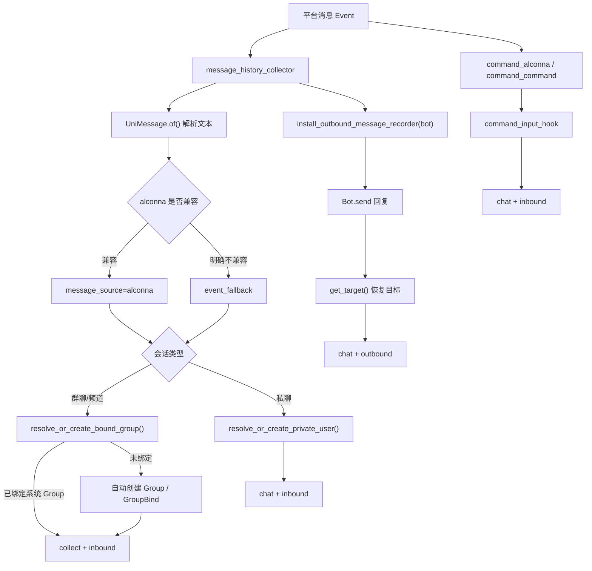

# message_history

`src/plugins/library/message_history/` 负责为系统提供“消息历史归档”能力。它只做事实记录、归属解析和基础检索，不做复杂语义判断，也不替 Agent 决定什么时候查询历史。

## 当前能力

- 采集系统群环境中的用户消息。
- 群聊首次出现时，自动创建系统 `Group` / `GroupBind` 绑定。
- 采集私聊中的用户消息。
- 采集用户直接调用命令时发出的命令消息。
- 记录机器人通过 `Bot.send` 发出的回复，包括普通命令回复和 AutoGPT 阶段性回复。
- 提供 `检索群聊记录` 命令。
- 提供 `command_executor` service handler，便于 Agent 显式调用。

## 数据分类

消息记录通过两个字段区分用途和方向：

- `record_kind=collect`：系统群环境采集消息，面向群上下文回顾。
- `record_kind=chat`：聊天流消息，面向用户或群空间中的人机对话。
- `direction=inbound`：用户发给机器人。
- `direction=outbound`：机器人发给用户或群。

常见规则：

- 群聊用户消息归档到 `storage/groups/{system_group_id}/chat/messages.db`。
- 群聊用户显式命令会额外归档到同一个系统群空间的 `chat`，用于保留“命令输入 -> 机器人回复”会话链。
- 群聊机器人回复归档到同一个系统群空间，但使用 `record_kind=chat`。
- 私聊用户消息和机器人回复都归档到 `storage/users/{user_id}/chat/messages.db`。

## alconna 接入约定

消息采集入口仍使用 NoneBot2 的 `on_message`，因为它需要捕获普通消息和命令消息；消息内容解析优先交给 `nonebot-plugin-alconna`：

- 入站消息文本：使用 `UniMessage.of(event.get_message(), bot=bot)` 转成统一消息模型。
- 出站目标恢复：使用 `get_target(event, bot)` 尽量恢复跨平台 target。
- 只有 `SerializeFailed`、`NotImplementedError`、`ValueError` 这类“适配器不支持、事件无法序列化、scope/adapter 不兼容”的情况才允许回退到原生事件字段。
- `RuntimeError`、`AttributeError` 等未知异常不应被当作兼容问题吞掉，应暴露给测试或日志排查。

入站消息会在 `metadata` 中记录：

- `message_source=alconna`：表示文本来自 alconna 统一消息模型。
- `message_source=event_fallback`：表示 alconna 明确不兼容后，才使用事件字段兜底。
- `message_fallback_reason`：记录触发兜底的异常类型。

命令输入还有一条额外约定：

- 通过 `command_alconna()` / `command_command()` 注册的非交互项目命令，会自动挂载命令输入记录 hook。
- 这条 hook 运行在命令 matcher 内部，不依赖全局 `on_message` 是否先命中。
- 因此这类命令即使 `block=True`，也仍然会把用户输入写入聊天记录。
- `got()` / `receive()` 一类多轮交互命令暂不复用这条 hook，仍以原消息采集链路为主，避免确认消息干扰交互状态机。
- 命令输入记录来源会写入 `metadata.source=command_input_hook`。

## 目录说明

- `commands.py`：命令声明、帮助元数据与统一命令绑定。
- `collector.py`：平台事件解析、消息文本提取与入站归档入口。
- `outbound.py`：机器人出站消息记录器，负责捕获 `Bot.send`。
- `resolvers.py`：平台会话到系统 `Group` / `User` 归属的解析逻辑。
- `services.py`：`command_executor` service handler 与可复用查询逻辑。
- `presenters.py`：群消息检索结果的展示渲染。
- `__init__.py`：NoneBot matcher 入口，仅保留 `handle` 级逻辑。

## 数据流

## 存储结构

消息数据库统一为：

- 文件名：`messages.db`
- 表名：`messages`

核心字段：

- `owner_kind` / `owner_id`：消息所属空间。
- `record_kind`：`collect` 或 `chat`。
- `direction`：`inbound` 或 `outbound`。
- `actor_role`：`user`、`assistant`、`system`。
- `message_id`：平台消息 ID，缺失时走内容哈希兜底。
- `user_id` / `user_name`：当前消息主体。
- `platform` / `platform_name`：平台标识。
- `channel_id` / `guild_id`：群、频道或父级频道标识。
- `bot_id`：处理或发送消息的 Bot ID。
- `platform_user_id`：当前消息主体在平台侧的 ID。
- `metadata`：扩展信息，如来源、事件类型、发送结果。

兼容说明：

- 旧版群消息表 `group_messages` 会在首次访问时自动迁移到统一 `messages` 表。
- 管理端读取旧库时也会补齐缺失列，避免仅因字段升级导致历史库不可读。

## Agent 开发约定

- 想回顾某个系统群最近讨论内容：调用 `检索群聊记录`。
- `检索群聊记录` 默认只读 `record_kind=collect`，不会把机器人回复混入群争议回顾。
- 想读取完整人机聊天流时，应明确过滤 `record_kind=chat`。
- 不要把平台群 ID 直接当作业务群主键，群归档使用系统内 `Group.id`。
- 不要把 `collect` 和 `chat` 两类消息混在一个检索意图里解释。

## 扩展建议

- 如果要新增“查询个人聊天历史”能力，建议新增独立命令，而不是复用群消息命令。
- 如果要接入向量检索或摘要索引，应在 `ChatHistoryStore` 之外增加索引层，保持 SQLite 事实层简单可靠。
- 如果要记录更多适配器字段，优先判断是否应成为显式列；低频字段再放入 `metadata`。
