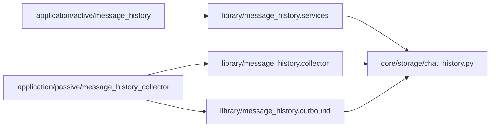

# message_history 能力库

`src/plugins/library/message_history/` 只提供消息历史归档的可复用能力，不注册 matcher、不声明命令，也不在导入时安装运行时 hook。

真正的 NoneBot 入口拆在应用插件层：

- 被动采集入口：`src/plugins/application/passive/message_history_collector`
- 主动查询命令：`src/plugins/application/active/message_history`

## 当前能力

- 从平台事件中提取消息文本，优先使用 `nonebot-plugin-alconna` 的 `UniMessage`。
- 明确不兼容时回退到原生事件字段，并在 metadata 中记录兜底原因。
- 按系统 `User.id` 或系统 `Group.id` 归档私聊和系统群消息。
- 提供机器人出站消息记录包装器，供 passive 入口安装。
- 提供群聊检索、聊天统计和展示渲染函数，供 active 命令与 Agent handler 复用。

## 数据分类

- `record_kind=collect`：系统群环境采集消息，面向群上下文回顾。
- `record_kind=chat`：聊天流消息，面向用户或群空间中的人机对话。
- `direction=inbound`：用户发给机器人。
- `direction=outbound`：机器人发给用户或群。

常见归档位置：

- 群聊消息：`storage/groups/{system_group_id}/chat/messages.db`
- 私聊消息：`storage/users/{user_id}/chat/messages.db`

## 文件职责

- `collector.py`：平台事件解析、消息文本提取、入站归档函数。
- `outbound.py`：机器人出站消息记录包装器。
- `services.py`：群聊检索、聊天统计参数解析和结果格式化。
- `presenters.py`：群消息检索结果展示渲染。
- `__init__.py`：轻量导出，不注册 matcher 或 hook。

## 边界规则

- 不在 library 中使用 `on_message`、`on_agent_command`、`on_alconna` 或 `on_command`。
- 不在 library 中注册 `command_executor.handler` 或 `register_command_input_recorder`。
- 需要捕获普通消息时，在 passive 应用插件中调用这里的 `collect_message()`。
- 需要提供用户命令或 Agent 工具时，在 active 应用插件中调用这里的查询和统计函数。

