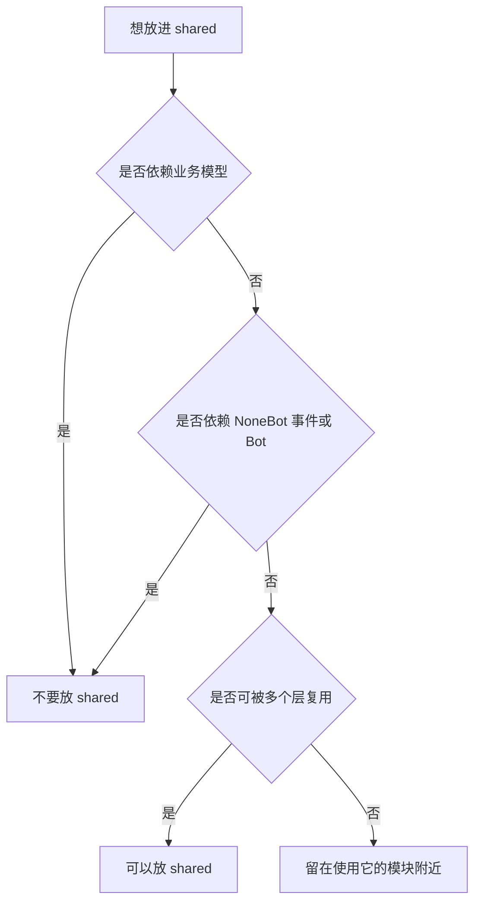

# shared 轻量共享层

`shared` 放没有业务归属、没有平台生命周期依赖的轻量通用组件。

它不是新的 `utils`，不要把不好分类的业务逻辑塞进来。

## 放什么

- 通用 schema、常量、轻量类型。
- 字符串、时间、路径、模板、加密等纯工具。
- 不依赖 NoneBot 事件、不依赖具体领域模型的辅助函数。

## 不放什么

- 命令框架。
- 跨平台发送。
- 用户身份解析。
- 文件空间业务规则。
- 消息历史采集。
- 数据模型和数据库访问。

## 判定规则

## 扩展规则

- 新增共享工具前先检查是否已有实现。
- 工具函数要保持窄职责，避免变成跨业务服务。
- 一旦工具开始依赖领域模型或插件生命周期，应迁到更合适的层。
