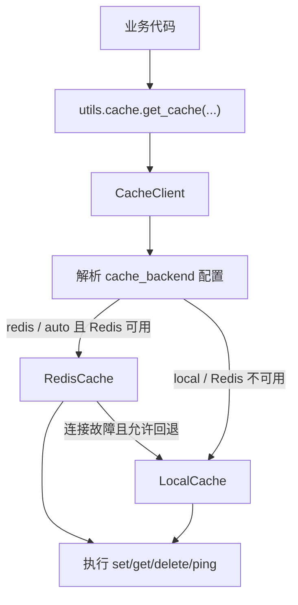

# `utils/cache`

`utils/cache` 是项目当前对缓存能力的统一入口。

它的职责很单一：

- 统一读取缓存配置
- 返回统一缓存客户端
- 提供少量便捷函数
- 在 Redis 不可用时自动切换到本地兜底存储

它适合存放短期、可丢失、可重建的运行时数据，不适合作为业务主数据存储。

## 目前在项目里的用途

当前仓库里，`utils/cache` 主要用于这几类场景：

- 跨平台绑定用户时保存临时 `token`
- 分享课表时保存短时分享 ID
- 管理端做缓存服务健康检查

对应调用位置可先看：

- `src/managers/user/__init__.py`
- `src/plugins/curriculum/__init__.py`
- `src/routers/managers/status.py`

## 文件结构

- `__init__.py`
  对外暴露统一入口 `CacheClient`、`get_cache`、`get_cache_storage_path`、`set`、`get`、`get_and_delete`
- `config.py`
  从 NoneBot 配置中读取缓存相关参数
- `local_cache.py`
  提供 `LocalCache`，负责基于 SQLite 的本地缓存兜底实现
- `fallback.py`
  兼容旧导入路径的薄封装，实际实现已经迁移到 `local_cache.py`
- `redis_cache.py`
  提供 `RedisCache`，负责 Redis 后端的实际读写

## 配置来源

缓存配置通过 NoneBot 驱动配置读取，当前使用的字段是：

- `CACHE_HOST`
- `CACHE_PORT`
- `CACHE_BACKEND`
- `CACHE_FALLBACK_ENABLED`
- `CACHE_CONNECT_TIMEOUT`
- `CACHE_PATH`
- `CACHE_LOCAL_PATH`

项目中可以参考根目录：

- `.env`
- `.env.test`

示例：

```env
CACHE_HOST=localhost
CACHE_PORT=6379
CACHE_BACKEND=auto
CACHE_FALLBACK_ENABLED=true
CACHE_PATH=
```

推荐含义：

- `CACHE_BACKEND=auto`
  优先尝试 Redis；启动探测失败时切换到本地 SQLite；如果运行过程中 Redis 出现可恢复连接故障，也会自动切换到本地
- `CACHE_BACKEND=redis`
  只使用 Redis，Redis 不可用时直接报错
- `CACHE_BACKEND=local`
  强制使用本地 SQLite 缓存
- `CACHE_PATH`
  可选，统一的缓存持久化路径配置；当前主要用于本地 SQLite 缓存文件，同时也是 Redis 模式下的兜底路径配置
- `CACHE_LOCAL_PATH`
  旧配置名，继续兼容读取；如果同时配置，`CACHE_PATH` 优先

补充说明：

- `auto` 模式一旦在当前进程内切到本地缓存，后续操作会继续复用本地后端，直到进程重启
- 当前自动回退只处理 Redis 连接类、超时类、网络类故障，不会吞掉业务层面的其他异常
- 如果未显式配置路径，默认会写到 `nonebot-plugin-localstore` 为 `classbot` 分配的缓存目录下

## 当前实现概览



## 对外 API

### `get_cache`

```python
from utils.cache import get_cache

cache = get_cache(db=0, decode_responses=True)
```

参数：

- `db`
  Redis 逻辑库编号，默认是 `0`
- `decode_responses`
  是否自动把返回值解码为字符串，默认是 `True`

返回值：

- `CacheClient`

这是最核心、也最推荐直接使用的入口。

这个返回值不是原始 `Redis` 客户端，而是项目自己的统一包装层。它目前对外保证的方法主要是：

- `set`
- `get`
- `delete`
- `ping`

内部结构上，它会组合：

- `RedisCache`
- `LocalCache`

调用方只需要使用 `CacheClient`，不需要主动判断当前到底走的是哪一个后端。

## `set`

```python
from utils.cache import set

await set("some:key", "value", ex=300)
```

这是一个简单包装函数，内部会：

1. 调用 `get_cache(db)`
2. 走统一 `CacheClient`
3. 根据当前后端转发到 `RedisCache` 或 `LocalCache`

参数：

- `key`
- `value`
- `ex`
- `db`

注意：

- 当前实现里 `ex` 的默认值是 `0`
- 当前统一客户端会把 `ex <= 0` 视为“不设置 TTL”
- 临时数据仍然建议显式传入一个正整数过期时间

### `get`

```python
from utils.cache import get

value = await get("some:key")
```

内部会复用共享的 `CacheClient`，再由它把读请求转发到当前生效的缓存后端。

### `get_and_delete`

```python
from utils.cache import get_and_delete

value = await get_and_delete("some:key")
```

适合一次性消费的数据，例如：

- 登录 token
- 绑定 token
- 临时确认码

它的行为是：

1. 先读取
2. 再删除
3. 返回读取到的值

## 推荐用法

### 1. 临时 token / 分享码

这种场景最贴近当前项目现状。

```python
from uuid import uuid4
from utils.cache import get_cache

token = str(uuid4())
cache = get_cache()
await cache.set(token, "123", ex=300)
```

读取时：

```python
cache = get_cache()
value = await cache.get(token)
await cache.delete(token)
```

### 2. 一次性读取并销毁

```python
from utils.cache import get_and_delete

value = await get_and_delete("bind:token:abc")
if value is None:
    ...
```

### 3. 健康检查

当前管理端就是这样做的：

```python
from utils.cache import get_cache

async with get_cache() as cache:
    await cache.ping()
```

### 4. 强制本地缓存

如果部署环境没有 Redis 服务，可以直接配置：

```env
CACHE_BACKEND=local
```

这样所有缓存读写都会直接走本地 SQLite 文件。

## 关于 `async with`

因此：

- `async with get_cache() as cache:` 适合短操作、探活、封装函数内部使用
- `cache = get_cache()` 适合沿用项目里现有写法

这里的 `async with` 主要是为了统一调用风格，不代表会额外新建一个独立缓存包装对象。

对 Redis 后端来说，统一客户端内部会按次创建并关闭真实 Redis 连接；对本地兜底后端来说，则会复用共享的 SQLite 存储文件。

如果你新增的是短生命周期逻辑，优先推荐：

```python
async with get_cache() as cache:
    ...
```

## 当前实现限制

### 1. 本地兜底使用 SQLite 文件，而不是内存缓存

这意味着：

- 没有 Redis 服务时，缓存仍然可以跨请求工作
- 数据会落到本地文件
- 适合作为单机兜底，不适合作为多实例共享缓存

之所以没有把 `local` 直接做成进程内内存缓存，主要是因为这个项目里的缓存不只是“性能优化层”，还承担了短期状态保存职责，例如：

- 跨平台绑定流程中的临时 `token`
- 分享课表时的短时分享 ID
- 一些只需要保留几分钟，但不希望因为机器人重启就立刻丢失的状态

如果 `local` 只是纯内存实现，那么进程重启、热更新、异常退出后，这些短期状态会立刻丢失。当前选择 SQLite 的目标不是完全模拟 Redis 的内存模型，而是提供一个：

- 零额外依赖
- 单机可运行
- 支持 TTL
- 在机器人进程重启后仍可恢复短期缓存

的本地兜底后端。

需要注意：

- Redis 本身虽然以内存读写为主，但并不等于“完全不落盘”
- 当前 `local` 的设计目标是“可靠兜底”，不是“最高吞吐”
- 如果未来确实需要更接近 Redis 语义的本地后端，可以再单独扩展 `local_memory` 一类实现

### 2. `set` 包装函数的默认 `ex=0` 要谨慎

虽然当前实现已经把 `ex <= 0` 解释为“不设置 TTL”，但对临时缓存场景来说，仍然建议显式给过期时间。

当前如果你使用包装函数 `utils.cache.set(...)`，建议始终显式传入 TTL：

```python
await set("bind:token", "123", ex=300)
```

### 3. 这里不是数据库

不要把下面这些数据放到缓存里做唯一事实来源：

- 用户主数据
- 教师、学生、班级、组织
- 需要长期保留的数据
- 需要审计追踪的数据

## 测试里怎么替换

命令测试没有直接连真实 Redis，而是用了内存版替身。

参考：

- `tests/commands/conftest.py`

里面定义了 `MemoryCache`，并通过 `monkeypatch` 替换：

```python
monkeypatch.setattr(cache_module, "get_cache", lambda db=0, decode_responses=True: cache)
```

如果你后面给命令补 `nonebug` / `pytest` 测试，推荐继续沿用这套方式，不要把单测绑到真实 Redis 服务。

另外，当前仓库也已经补了针对本地 SQLite 兜底的回归测试，可参考：

- `tests/utils/test_cache_fallback.py`

该测试目前覆盖了：

- 启动探测失败时从 Redis 自动切到本地缓存
- 运行过程中 Redis 故障时自动切到本地缓存
- 本地缓存 TTL 与删除行为
- 本地 SQLite 缓存在运行时重建后仍可继续读取
- `set` / `get` / `get_and_delete` 便捷函数
- `CACHE_PATH` 与旧配置 `CACHE_LOCAL_PATH` 的兼容与优先级
- 管理端状态接口对本地缓存路径和后端类型的返回

## 建议阅读顺序

1. 先看 `utils/cache/__init__.py`
2. 再看 `utils/cache/config.py`
3. 然后看 `src/managers/user/__init__.py` 的 token 流程
4. 最后看 `tests/commands/conftest.py` 的 `MemoryCache`
