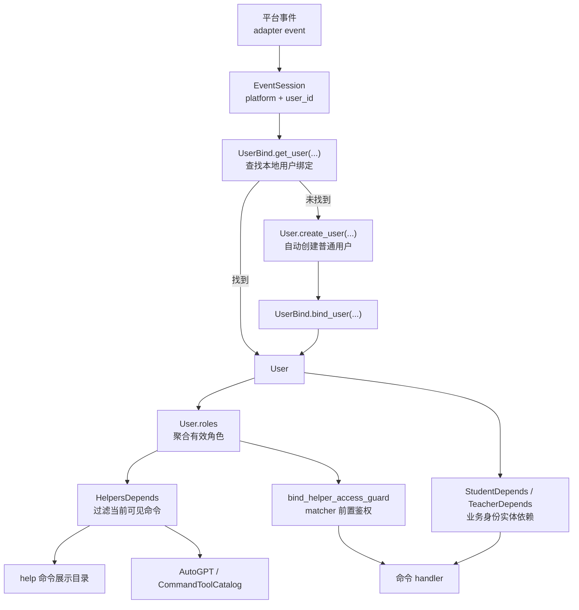

# Helper、身份与命令鉴权说明

本目录承接的是 ClassRobot 当前最核心的一条运行时规则链路：

- 用户是谁
- 用户当前拥有哪些有效角色
- `help` 应该展示哪些命令
- AutoGPT 能看到哪些命令
- 命令真正执行前如何再做一次兜底鉴权

如果你要改命令权限、补帮助文档、接 AutoGPT 命令目录，或者排查“为什么这个身份看得到/用不了某个命令”，先从这里读起。

## 相关文件

- `utils/models/depends.py`
  - 把平台事件映射为本地 `User`
  - 提供 `UserDepends`、`UserOrCreatedDepends`、`StudentDepends`、`TeacherDepends`
- `utils/models/models.py`
  - 定义 `User`、`Student`、`Teacher`、`UserBind`
  - `User.roles` 在这里统一派生
- `utils/helper/schema.py`
  - 定义 `Helper`、`Helpers`
  - 实现 `roles / exclude_roles / scopes` 的可见性规则
- `utils/helper/runtime.py`
  - 启动时收集 `__helpers__`
  - 把运行时鉴权 guard 绑定到 matcher 前面
- `utils/helper/depends.py`
  - 基于 `user.roles` 过滤出当前用户可见的命令集合
- `src/plugins/helper/__init__.py`
  - `help` 命令入口
- `src/plugins/autogpt/`
  - 使用过滤后的 helpers 构建 Agent 可见命令目录

## 总体流向图

## 身份从哪里来

系统不是直接拿平台原生身份做权限判断，而是先把平台用户映射为本地 `User`。

### 第一步：平台用户绑定到本地用户

`utils/models/depends.py` 里有两条基础依赖：

- `UserDepends`
  - 只查，不创建
  - 通过 `platform + user_id` 去 `UserBind` 找本地 `User`
- `UserOrCreatedDepends`
  - 查不到就自动创建一个普通用户
  - 然后写入 `UserBind`

因此，“谁在发命令”最终会被收敛成一个本地 `User` 实体，而不是直接信任平台侧的昵称或群角色。

### 第二步：从 `User` 派生当前有效角色

真正用于命令筛选的不是单值 `user.role`，而是 `User.roles`。

当前派生规则位于 `utils/models/models.py` 的 `User.roles` 属性，大致如下：

1. 所有用户默认拥有 `user`
2. `user.is_admin == True` 时追加 `admin`
3. 绑定了学生实体 `user.student` 时追加 `student`
4. 绑定了教师实体 `user.teacher` 时追加 `teacher`
5. 学生岗位不是普通学生时，追加 `class_cadre`

这意味着一个用户可以同时拥有多种角色，例如：

- `user`
- `user + student`
- `user + teacher + admin`
- `user + student + class_cadre`

## `user.role` 和 `user.roles` 的区别

项目里历史上同时存在这两个概念：

- `user.role`
  - 单值字段
  - 更像历史兼容用的“主身份”或默认展示字段
- `user.roles`
  - 运行时聚合角色集合
  - 当前帮助系统、统一鉴权、AutoGPT 可见性都基于它

新增代码请优先用：

- `user.roles` 做命令可见性和角色筛选
- `user.student` / `user.teacher` 做业务实体级判断

不要再把单个 `user.role` 当作唯一权限来源。

## `Helper` 是怎么控制命令开放的

每个命令模块都可以声明 `__helpers__`，里面的 `Helper(...)` 是这条命令对外暴露的事实来源。

最关键的三个字段：

### `roles`

- 表示“哪些角色可以使用”
- 语义是“命中任一角色即可”
- 不是“必须同时拥有所有角色”

例如：

- `roles={student, teacher}`
  - 学生可以用
  - 教师也可以用

### `exclude_roles`

- 表示“这些角色即使命中了 `roles` 也要额外禁止”
- 适合表达“普通用户可走入口，但某个已绑定身份不能再走”

例如：

- `roles={user, teacher}`
- `exclude_roles={student}`

表示：

- 普通用户可以使用
- 教师可以使用
- 但学生被明确排除

### `scopes`

- 只决定 `help` 里放到哪个目录
- 不直接代替真实执行权限

当前目录包括：

- `public`
- `user`
- `student`
- `teacher`
- `admin`

## 运行时是怎么真正拦截命令的

`help` 过滤不是唯一防线。系统启动时，`bootstrap_helper_runtime(...)` 会把每个 helper 绑定到对应 matcher 前面。

绑定逻辑在 `utils/helper/runtime.py`：

1. 收集所有插件里的 `__helpers__`
2. 把它们放进全局 `helper_menu`
3. 根据命令名找到 matcher
4. 注入一个前置 handler
5. 前置 handler 用 `user.roles` 调用 `Helper.is_available_for(...)`
6. 不满足就直接 `finish(...)`

所以当前项目里至少有三层一致的能力边界：

1. `help` 只展示当前用户可见命令
2. AutoGPT 只拿到当前用户可见命令
3. matcher 执行前再次做统一拦截

## `help` 和 AutoGPT 为什么会保持一致

原因是它们都吃同一份 `HelpersDepends`。

- `utils/helper/depends.py`
  - 根据 `user.roles` 返回过滤后的 `Helpers`
- `src/plugins/helper/__init__.py`
  - `help` 用这份结果渲染目录
- `src/plugins/autogpt/*`
  - AutoGPT 用这份结果构建 `CommandToolCatalog`

只要命令补齐了 `Helper` 元数据，这三处就会自然保持一致。

## 什么时候还要看 `StudentDepends` / `TeacherDepends`

`Helper.roles` 解决的是“当前用户有没有资格进入这条命令”。

但很多业务命令还需要进一步判断具体实体状态，例如：

- 是否真的绑定了学生档案
- 当前教师是否管理这个班级
- 当前学生是否已经加入班级

这类判断不要继续挤进 `Helper.roles`，而应该使用：

- `StudentDepends`
- `TeacherDepends`
- `ClassesDepends`
- 或命令内部的领域规则

可以把它理解成：

- `Helper.roles`：入口级能力边界
- `StudentDepends / TeacherDepends`：业务实体边界
- 领域服务 / 模型方法：最终业务约束

## 新增命令时的推荐步骤

1. 先写 `on_alconna(...)` matcher
2. 在同模块补一条 `Helper(...)`
3. 明确填写 `roles / exclude_roles / scopes`
4. 如果命令是管理员专用，再决定是否额外接 `AdminExtension` 或后台 token 校验
5. 业务内部继续使用 `user.student`、`user.teacher`、`StudentDepends`、`TeacherDepends` 做实体级校验
6. 补 `nonebug` 或相关单测，覆盖不同身份下的可用性

## 常见误区

### 误区一：`roles={teacher, student}` 表示必须同时拥有两个身份

不是。当前实现是并集语义，命中任一角色即可通过。

### 误区二：`help` 看不到就等于后端绝对安全

不是。真正的安全兜底是 runtime guard 和业务实体校验。

### 误区三：`user.role` 就是完整权限模型

不是。当前真实权限视角应优先看 `user.roles`。

## 建议阅读顺序

1. 先看本文，理解整体链路
2. 再看 `utils/models/depends.py`
3. 再看 `utils/models/models.py` 的 `User.roles`
4. 再看 `utils/helper/schema.py`
5. 最后看 `utils/helper/runtime.py` 和 `src/plugins/helper/__init__.py`

## 对应专题文档

- `docs/guides/command-auth-and-help.md`
- `docs/reference/role-reference.md`
- `docs/guides/message-processing-flow.md`
