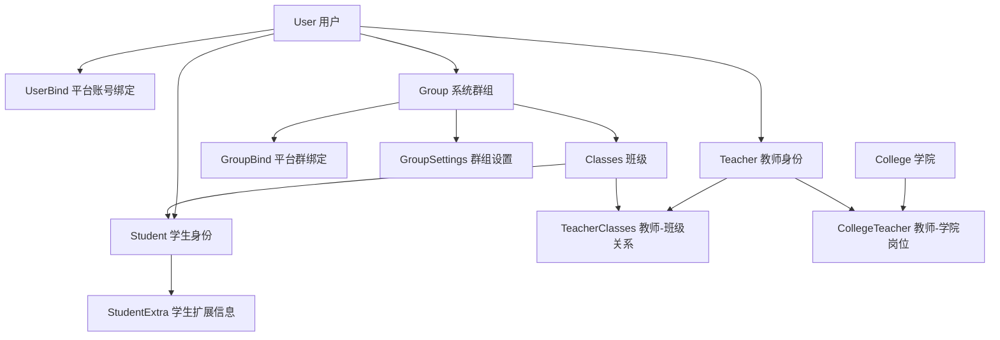

# models 模块说明

`utils/models` 是项目的业务数据核心层。

如果把整个项目分成“命令解析”“业务逻辑”“数据库存储”三层，那么这里就是中间那层最重要的基础设施之一：

- 它定义了数据库表结构。
- 它定义了表和表之间的关系。
- 它把一部分高频业务动作直接封装成模型方法。
- 它为命令层、管理端、Agent、后台任务提供统一的数据访问入口。

这份 README 的目标不是逐字段复述源码，而是用更通俗的话说明：

- 每张核心表是干什么的。
- 几张表之间是什么关系。
- 模型自带的方法会做什么。
- 调用某个方法后，除了“查到数据/写入数据”，还会不会顺手更新别的表、删掉文件、清理失效绑定。

## 目录结构

`utils/models` 目前主要包含下面几个文件：

- `models.py`
  - 绝大多数业务表和业务方法都在这里。
- `filters.py`
  - 提供 `FilterModel`、`Filter`、`SelectFilter` 这几个通用查询/增删改封装。
- `columns.py`
  - 定义统一主键、创建时间、更新时间字段别名。
- `depends.py`
  - 给 NoneBot 命令层提供依赖注入，比如“拿当前用户”“拿当前教师”“拿当前班级”。

## 先记住三个总规则

### 1. 表名默认会自动带 `bot_` 前缀

所有继承 `FilterModel` 的模型，如果没有手动写 `__tablename__`，都会自动把类名转换成蛇形命名并加上 `bot_` 前缀。

例如：

- `User` -> `bot_user`
- `UserBind` -> `bot_user_bind`
- `TeacherClasses` -> `bot_teacher_classes`
- `CollegeTeacher` -> `bot_college_teacher`

### 2. 这里的“群组”是系统群，不等于平台原始群号

项目里真正的业务主体是系统内的 `Group` 表。

- `Group.id`
  - 系统自己的群组主键。
- `GroupBind`
  - 负责把“QQ 群 / 子频道 / 频道”等平台侧标识，绑定到系统 `Group`。

所以：

- 平台群号只是绑定信息的一部分。
- 聊天记录、文件空间、班级关联，最终都挂在系统 `Group.id` 上。

这也是为什么很多逻辑会先查 `GroupBind`，再拿到真正的 `Group`。

### 3. 一些模型方法不只是“查数据”，还会顺手做清理

这是本模块最容易被忽略的地方。

例如：

- `UserBind.get_user(...)`
  - 如果发现绑定记录还在，但对应 `User` 已经不存在，会顺手删除这条脏绑定。
- `UserBind.bind_user(...)`
  - 如果平台账号从旧用户改绑到新用户，并且旧用户已经没有任何绑定，会继续删除旧用户账号及其关联数据和文件空间。
- `GroupBind.get_group(...)`
  - 如果发现平台群绑定还在，但对应 `Group` 不存在，会顺手删除失效绑定。
- `GroupBind.bind_group(...)`
  - 在某些“改绑群组”的场景下，会顺手删除旧的空群组和它的设置。
- `User.delete_account(...)`
  - 不只删 `User` 表，还会递归删外键子表、Agent 工作流表，并尽力删掉用户文件空间。
- `Classes.delete_related_group(...)`
  - 会连带删掉班级、系统群、群设置、群绑定和群文件空间。

## 通用基础能力

## `columns.py`

这里统一了常用列定义：

- `PrimaryKeyInteger`
  - 自增整型主键。
- `CreateAt`
  - 创建时间。
- `UpdateAt`
  - 更新时间，更新记录时会自动刷新。

这样做的好处是：

- 所有表的主键/时间字段风格一致。
- 修改时间字段策略时，不需要逐表重写。

## `FilterModel`

所有业务模型几乎都继承自 `FilterModel`，所以默认都带下面这些能力。

### `await model.create()`

作用：

- 把当前对象插入数据库。
- 提交事务。
- 再 `refresh` 一次，把数据库里生成的 `id` 等字段回填回来。

适合：

- `await User(...).create()`
- `await StudentExtra(student=student).create()`

### `await model.update(**kwargs)`

作用：

- 按当前对象的 `id` 更新数据库。
- 返回更新后的最新对象。

特点：

- 这是“实例式更新”。
- 你拿到的是更新后的模型对象，不是 SQL 执行结果。

### `await model.delete()`

作用：

- 直接删除当前对象并提交事务。

注意：

- 这只是最基础的删除。
- 如果某个模型有更复杂的业务删除要求，通常会另外提供专门方法，比如：
  - `User.delete_account()`
  - `Group.delete_group()`
  - `Classes.delete_related_group()`

开发时优先用这些“业务删除方法”，不要默认只调基础 `delete()`。

### `Model.filter(...)`

这是本项目里最常用的查询入口。

常见写法：

```python
await User.filter(id=1).first()
await Student.filter(classes_id=classes.id).all()
await UserBind.filter(platform_id=platform, account_id=account).exists()
await ClassesJoinRequest.filter(classes_id=classes.id).count()
```

它返回的是 `Filter` 对象，常用能力有：

- `.first()`
  - 取第一条。
- `.all()`
  - 取全部列表。
- `.count()`
  - 统计数量。
- `.exists()`
  - 判断是否存在。
- `.update(...)`
  - 直接批量更新符合条件的记录。
- `.delete()`
  - 直接批量删除符合条件的记录。

### `Model.select`

`select` 是偏底层、但很灵活的查询构造器，适合：

- 要 `join`
- 要复杂 `where`
- 要配合 `selectinload`

例如 `Teacher.get_classes()` 就用了 `join` 方式查教师与班级、群绑定之间的关系。

## 核心关系图

下面这张图只画项目里最常见、最关键的关系。



理解这张图后，再看下面每张表会轻松很多。

## 用户与身份域

## `User`

### 这张表是干什么的

`User` 是系统内部“账号主体”。

无论这个人最终是：

- 普通用户
- 学生
- 教师
- 管理员

底层都先要有一条 `User` 记录。

### 它和谁有关

- 一对多：`UserBind`
  - 一个系统用户可以绑定多个平台账号。
- 一对一：`Teacher`
  - 这个用户可能有教师身份。
- 一对一：`Student`
  - 这个用户可能有学生身份。
- 一对多：`Group`
  - 这个用户可以创建多个系统群。

### 关键方法

#### `roles`

作用：

- 动态计算当前用户拥有哪些角色标签。

返回逻辑：

- 默认一定有 `user`
- `is_admin=True` 时增加 `admin`
- 关联了 `student` 时增加 `student`
- 关联了 `teacher` 时增加 `teacher`
- 如果学生身份是班干部，还会增加 `class_cadre`

注意：

- 这是“根据当前关联状态实时推导”的，不是单独一张角色表。

#### `login(username, password)`

作用：

- 按用户名查用户，再调用 `check_password` 判断密码是否匹配。

当前实现特点：

- 现在是直接字符串比较。
- 也就是说当前并没有做密码哈希校验。

#### `create_user(...)`

作用：

- 创建最基础的 `User`。

不会自动做的事：

- 不会自动绑定平台账号。
- 不会自动创建学生/教师身份。

这些通常要配合 `UserBind.bind_user(...)`、`Student.create_student(...)`、`Teacher.create_teacher(...)`。

#### `get_bind(platform_id)`

作用：

- 查“当前这个用户”在某个平台上的绑定记录。

典型用途：

- 判断用户是否已经绑定 QQ / 频道 / 其他平台。

#### `get_groups()`

作用：

- 查这个用户创建的所有系统群。

这个方法常用于：

- 删除用户前判断他是否还拥有群组。
- 管理端展示用户拥有的群。

#### `delete_account(manager=None)`

作用：

- 这是用户删除的正式业务入口。

工作逻辑：

1. 确认用户是否仍存在。
2. 递归删除所有依赖 `User` 外键的子表记录。
3. 额外删除没有外键约束的：
   - `AgentWorkflowCheckpoint`
   - `AgentWorkflowRun`
4. 删除 `User` 本身。
5. 最后尽力删除用户文件空间：
   - `storage/users/{user_id}`

副作用：

- 会连带删掉依赖当前用户的很多业务记录。
- 文件空间删除失败时，只记日志，不会把数据库删除结果回滚。

什么时候该用它：

- 管理端删除用户
- 命令层“注销用户”
- 某些自动回收无主账号的场景

不建议：

- 直接 `await user.delete()` 替代它，因为那样可能留下业务脏数据或文件残留。

## `UserBind`

### 这张表是干什么的

它负责把：

- 平台侧用户标识

映射到：

- 系统内部 `User.id`

可以理解成“平台账号 -> 系统账号”的桥。

### 常见字段怎么理解

- `platform_id`
  - 平台类型，比如某个适配器标识。
- `account_id`
  - 该平台上的用户唯一标识。
- `user_id`
  - 系统内部用户主键。

### 关键方法

#### `get_bind(platform_id, account_id)`

作用：

- 查某个平台账号当前绑到了哪个系统用户。

效果：

- 只返回绑定记录，不自动返回 `User` 对象。

适合：

- 想看“有没有绑定”
- 想拿绑定记录本身做进一步操作

#### `get_user(platform_id, account_id)`

作用：

- 通过平台账号直接拿系统用户。

工作逻辑：

1. 先查 `UserBind`
2. 再根据 `bind.user_id` 查 `User`
3. 如果绑定还在，但用户已经没了，说明出现了脏绑定
4. 这时会顺手删除这条失效绑定

副作用：

- 可能会删掉一条失效的 `UserBind`

这也是为什么它不仅是“查询方法”，也是“顺手纠偏方法”。

#### `bind_user(platform_id, account_id, user)`

作用：

- 把平台账号绑定到系统用户。

工作逻辑分三种情况：

第一种：原来就绑定的是这个用户

- 直接返回原绑定，不做额外操作。

第二种：原来绑定的是别的用户

1. 把 `UserBind.user_id` 改成新的用户
2. 检查旧用户还有没有别的平台绑定
3. 如果旧用户已经没有任何绑定
4. 调用 `old_user.delete_account()`

第三种：原来没有绑定

- 直接创建新的 `UserBind`

副作用：

- 在“改绑”时，旧用户有可能被整账号删除。
- 旧用户删除后，会继续级联清理它的关联业务数据和文件空间。

通俗理解：

- 这个方法不是“单纯插一条绑定记录”。
- 它在做“平台身份迁移”。

## `AgentWorkflowCheckpoint` / `AgentWorkflowRun`

这两张表主要给 Agent 工作流用。

- `AgentWorkflowCheckpoint`
  - 保存“当前用户最新的一份工作流检查点”，偏恢复现场。
- `AgentWorkflowRun`
  - 保存“每次工作流运行的历史记录”，偏审计和追踪。

它们本身没有太多业务方法，但要知道一点：

- `User.delete_account()` 会额外删除这两张表里和该用户相关的数据。

## 学校、班级、群组域

## `School` / `College` / `Major`

这三张表是学校层级基础数据。

关系是：

- `School` -> `College` -> `Major`

同时：

- `School` 也直接关联班级、教师、学生、组织
- `College` 也直接关联班级、教师

### `Major.get_or_create_major(name, college)`

作用：

- 在同一个学院下按名称查专业。
- 没有就创建。

适合：

- 导入班级数据
- 批量创建院系结构

## `GroupSettings`

这是一张很轻的配置表，主要存群组设置。

当前最关键的字段是：

- `join_method`
  - 班级/群组的加入方式

它通常不会被单独操作，而是跟 `Group` 一起使用。

## `Group`

### 这张表是干什么的

`Group` 表示系统内部的“群组主体”。

它不是平台群号，而是：

- 可被平台绑定复用
- 可挂载班级
- 可拥有文件空间和聊天记录空间

的那个核心对象。

### 它和谁有关

- 多对一：`creator -> User`
- 一对一：`settings -> GroupSettings`
- 一对多：`GroupBind`
- 一对一：`Classes`

### 关键方法

#### `create_group(name, creator)`

作用：

- 创建系统群组。
- 同时自动创建一条 `GroupSettings`。

副作用：

- 会多创建一条群设置记录。

#### `get_binds()`

作用：

- 查这个系统群对应了哪些平台绑定。

#### `delete_group(manager=None)`

作用：

- 删除系统群组。

工作逻辑：

1. 先判断这个群是否还挂着班级。
2. 如果挂着班级，直接转交给 `Classes.delete_related_group()` 处理。
3. 如果没有班级：
   - 删除 `GroupBind`
   - 删除 `Group`
   - 删除 `GroupSettings`
4. 最后尽力删掉群文件空间：
   - `storage/groups/{group_id}`

副作用：

- 可能会连班级一起删。
- 会删除对应群的聊天和文件空间。

## `GroupBind`

### 这张表是干什么的

它负责把平台群信息绑定到系统 `Group`。

你可以把它理解成：

- “平台群号/频道号/子频道号” -> “系统群组主键”

### 为什么它很重要

因为很多逻辑不会直接记平台群号，而是：

1. 先查 `GroupBind`
2. 再拿到系统 `Group`
3. 最后再去找班级、聊天记录、文件空间

### 关键方法

#### `get_bind(platform_id, channel_id, guild_id=None)`

作用：

- 按平台信息找绑定记录。

适合：

- 想知道“这个平台群当前映射到哪个系统群”

#### `get_group(platform_id, channel_id, guild_id=None)`

作用：

- 按平台信息直接拿系统 `Group`

工作逻辑：

1. 先查 `GroupBind`
2. 再根据 `group_id` 查 `Group`
3. 如果发现绑定还在，但 `Group` 已不存在
4. 顺手删除这条失效绑定

副作用：

- 可能删除一条脏 `GroupBind`

#### `bind_group(platform_name, platform_id, channel_id, guild_id, group)`

作用：

- 把某个平台群绑定到指定系统群。

工作逻辑：

第一种：已有绑定，且原本就指向这个群

- 只更新部分字段，比如名称、`guild_id`

第二种：已有绑定，但原本指向另一个系统群

1. 先检查旧群是否挂着班级
2. 如果旧群有班级，拒绝改绑并抛 `ValueError`
3. 如果旧群没有班级，则允许把绑定改到新群
4. 改绑后再检查旧群是否还有别的绑定
5. 如果旧群已经没有班级，也没有任何绑定
6. 删除旧群和它的 `GroupSettings`

第三种：原本没有绑定

- 直接新建一条 `GroupBind`

副作用：

- 在“改绑”情况下，旧的空系统群可能被自动删除。
- 但如果旧群已经承载班级，会直接阻止改绑，避免误删班级数据。

这套逻辑的设计目的，是保护班级群不被错误重绑。

## `Teacher`

### 这张表是干什么的

`Teacher` 是 `User` 的教师身份扩展。

一个 `User` 最多对应一个 `Teacher`。

### 关键方法

#### `create_teacher(name, user, school_id=None, college_id=None)`

作用：

- 给一个 `User` 创建教师身份。

工作逻辑：

1. 断言该用户当前不是学生身份
2. 创建 `Teacher`
3. 把 `user.role` 更新为 `teacher`

副作用：

- 会修改 `User.role`

#### `get_teacher(user)`

作用：

- 通过 `User` 找它的教师身份。

#### `get_or_create_teacher(name, user)`

作用：

- 有就返回，没有就创建。

#### `get_classes(platform_id, channel_id=None, guild_id=None)`

这是教师域里最实用的方法之一。

支持三种查法：

- 传 `int`
  - 按 `classes.id` 查
- 传字符串且 `channel_id is None`
  - 按班级名称查
- 传平台信息
  - 通过 `GroupBind` 去查当前教师管理的班级

适合：

- 教师在群里执行命令时，快速判断“当前是不是我管理的班级群”

#### `bind_classes(classes)`

作用：

- 给教师绑定班级。

注意：

- 这是直接往多对多关系里追加，不做重复校验。
- 更常用的是通过 `Classes.bind_teacher(...)` 间接调用。

#### `get_managed_college_ids()`

作用：

- 查询当前教师以学院负责人身份管理的学院 ID 集合。

工作逻辑：

1. 查询 `CollegeTeacher` 中 `teacher_id` 等于当前教师 ID 的记录。
2. 只认可 `role=manager` 的关系。
3. 返回这些关系里的 `college_id` 集合。

副作用：无。

#### `manages_college(college_id)`

作用：

- 判断当前教师是否负责指定学院。

工作逻辑：

- `college_id` 为空时直接返回 `False`。
- 否则复用 `get_managed_college_ids()` 判断是否命中。

常用于：

- 学院负责人管理教师、学生、班级和班级岗位时的动态权限校验。

## `Classes`

### 这张表是干什么的

`Classes` 是班级主体表。

它一头连着：

- 学校 / 学院 / 专业

另一头连着：

- 系统群 `Group`
- 教师关系 `TeacherClasses`
- 学生 `Student`

### 最关键的认知

班级和系统群是一对一关系。

也就是说：

- 一个班级一定挂在一个系统群上。
- 删除班级时，经常需要一起处理对应群。

### 关键方法

#### `get_task(task_id)`

作用：

- 在当前班级下查任务。

支持：

- 按任务 ID 查
- 按任务名称查

#### `get_join_requests()`

作用：

- 查当前班级的入班申请列表。

#### `student_count()`

作用：

- 统计班级学生数量。

常用于：

- 删除班级前确认是否还有学生

#### `delete_related_group(manager=None)`

作用：

- 这是“删班级”的正式业务入口。

工作逻辑：

1. 记录当前 `group_id`
2. 找到对应 `Group.settings_id`
3. 先删除 `Classes`
4. 再删除该班级挂着的：
   - `GroupBind`
   - `Group`
   - `GroupSettings`
5. 最后尽力删除群文件空间：
   - `storage/groups/{group_id}`

为什么顺序这么重要：

- 如果先删 `Group`，某些 ORM 删除路径可能先把 `classes.group_id` 设成空值
- 而 `classes.group_id` 在数据库里不允许为空
- 所以这里强制按“班级 -> 群 -> 群设置”的顺序删

副作用：

- 不只删班级记录。
- 会连带删掉平台群绑定、系统群、群设置、群聊天/文件空间。

#### `user_join_classes(user)`

作用：

- 让一个系统用户加入班级。

工作逻辑：

- 如果用户还没有学生身份
  - 自动创建 `Student`
- 如果用户已经是学生
  - 调用 `student.update_classes(...)` 改班级

副作用：

- 可能新建 `Student`
- 可能修改 `Student.classes_id`
- 学生切换班级时会同步 `Student.school_id`

#### `apply_join_classes(user, describe=None)`

作用：

- 创建一条入班申请 `ClassesJoinRequest`

#### `get_classes(platform_id, channel_id=None, guild_id=None)`

作用：

- 全局查班级。

支持两种入口：

- 传 `int`
  - 按班级 ID 查
- 传平台信息
  - 通过 `GroupBind` 查出系统群，再拿它挂载的班级

注意：

- 这个方法不能按班级名全局搜索。

#### `create_classes(...)`

作用：

- 创建班级，并把班级和平台群关联起来。

工作逻辑：

1. 先调用 `GroupBind.get_group(...)`
2. 如果该平台群之前已经绑定过系统群，则复用那个系统群
3. 如果没有绑定过，则新建 `Group`
4. 无论复用还是新建，都会调用 `GroupBind.bind_group(...)`
5. 最后再创建 `Classes`

这意味着：

- 平台群第一次被识别为班级时，不一定总是新建系统群
- 已有系统群时会尽量复用

#### `bind_teacher(teacher, role=TeacherClassesRole.teacher)`

作用：

- 给班级绑定教师。

底层实际走的是：

- `TeacherClasses.association(...)`

说明：

- 如果教师已绑定该班级，会更新岗位而不是重复插入。
- 新增班级教师时应优先走这个方法，避免绕过 `TeacherClasses` 的唯一约束。

#### `update_teacher_role(teacher, role)`

作用：

- 修改某位教师在当前班级里的角色，比如班主任、教师等。

## `ClassesJoinRequest`

这张表很单纯，表示“用户申请加入班级”的记录。

核心字段：

- `classes_id`
- `user_id`
- `join_method`
- `describe`

它本身没有复杂方法，通常由：

- `Classes.apply_join_classes(...)`

来创建，由命令层审核后删除。

## `TeacherClasses`

这张表是教师和班级的多对多中间表。

除了“有没有绑定关系”，它还保存：

- 教师在班级里的角色 `role`

### `association(teacher, classes, role=...)`

作用：

- 创建一条教师-班级关联记录。

注意：

- 当前实现会先检查同一教师和班级是否已有关系。
- 已存在时更新 `role` 并返回原关系。
- 不存在时创建新关系。

## `CollegeTeacher`

这张表是教师和学院的管理岗位关系表。

它解决的问题是：

- `UserRole.teacher` 只能说明“这个人是教师”。
- `Teacher.college_id` 只能说明“这个教师属于哪个学院”。
- `CollegeTeacher` 才说明“这个教师是否负责某个学院，以及权限在哪个学院内生效”。

核心字段：

- `teacher_id`
- `college_id`
- `role`

### `association(teacher, college, role=CollegeTeacherRole.manager)`

作用：

- 创建或更新教师与学院的岗位关系。

工作逻辑：

1. 先查同一教师和学院是否已有关系。
2. 已有关系时，如果岗位不同则更新岗位。
3. 没有关系时创建新记录。

副作用：

- 只写 `CollegeTeacher` 表，不会自动修改 `UserRole`。
- 调用方需要在命令或 service 层校验教师的学校/学院归属是否允许对齐。

## `Student`

### 这张表是干什么的

`Student` 是 `User` 的学生身份扩展。

一个 `User` 最多对应一个 `Student`。

### 关键方法

#### `create_student(name, classes, user, school_id=None, **kwargs)`

作用：

- 给用户创建学生身份，并归入指定班级。

工作逻辑：

1. 确定学校 ID，优先用传入值，否则继承班级的学校
2. 创建 `Student`
3. 自动创建一条 `StudentExtra`
4. 如果这个用户不是教师身份
5. 把 `User.role` 改成 `student`

副作用：

- 会自动创建 `StudentExtra`
- 可能会修改 `User.role`

#### `update_classes(classes)`

作用：

- 把学生转到另一个班级。

副作用：

- 会把学生角色重置成普通 `student`
- 会同步更新 `classes_id`
- 会同步更新 `school_id`，让学生冗余学校归属与新班级保持一致

#### `get_classmates()`

作用：

- 获取同班同学列表。

## `StudentExtra`

这是学生附加资料表，放学号、寝室、政治面貌、家庭联系方式等。

### `update_extra(**kwargs)`

作用：

- 更新这些扩展字段。

它本质上只是对 `update(...)` 的语义化封装。

## 组织域

## `Organization`

这张表表示学校里的组织，比如学生会、社团、党支部等。

它和班级不同，班级是教学组织，`Organization` 是更泛化的成员型组织。

### `get_or_create_organization(...)`

作用：

- 同一学校、同一组织类型下按名称查找组织，没有就创建。

### `get_students()` / `get_teachers()`

作用：

- 通过成员关系表取出组织里的学生或教师。

### `add_student(student, position=None)`

作用：

- 把学生加入组织。

工作逻辑：

- 如果已经是成员
  - 需要时更新岗位 `position`
- 如果还不是成员
  - 创建一条 `OrganizationMember`

`add_teacher(...)` 逻辑相同。

## `OrganizationMember`

这张表是组织成员关系表。

它有两个很重要的约束：

- 一条记录只能是“学生成员”或“教师成员”其中一种
- 同一组织里，同一个学生/教师不能重复出现

通俗理解：

- 这张表就是组织的花名册。

## 文件与任务域

## `Files`

### 这张表是干什么的

它保存“系统管理的文件元数据”。

真正的文件内容在磁盘里，这张表保存的是：

- 名称
- MD5
- 相对路径
- 后缀

### 关键方法

#### `file_duplicate(file_md5)`

作用：

- 仅判断这个 MD5 是否已经存在。

#### `get_file(file_md5)`

作用：

- 按 MD5 拿文件记录。

#### `new(file_md5, file_path, name=None, suffix=None)`

作用：

- 只创建文件元数据记录。

注意：

- 它假设文件本体已经在磁盘上了。

#### `parse_data(file_data, save_path, suffix=None, file_md5=None)`

作用：

- 从字节数据落盘并创建 `Files` 记录。

工作逻辑：

1. 计算或接收 MD5
2. 推断后缀
3. 把字节写到指定目录
4. 再创建 `Files`

注意：

- 这个方法本身不会先做去重拦截。
- 如果业务需要避免重复文件，应该先配合 `file_duplicate(...)` 使用。

#### `path`

作用：

- 返回文件在本地的完整路径。

#### `delete()`

作用：

- 先删磁盘文件，再删数据库记录。

副作用：

- 这是“物理删除”，不只是删表记录。

## `Tasks`

这张表表示班级任务/作业本身。

### 关键方法

#### `get_commits()`

作用：

- 查当前任务的所有提交记录。

#### `create_task(...)`

作用：

- 创建任务主体。

#### `delete()`

作用：

- 删除任务。

工作逻辑：

1. 先遍历任务的所有提交
2. 对每个提交先删它关联的文件
3. 最后删除任务本身

副作用：

- 会物理删除提交文件。
- `TaskCommits` 记录通常会随着任务删除被级联清理。

#### `commit(student, file_data)`

作用：

- 学生提交任务文件。

工作逻辑：

1. 先把字节文件转成 `Files`
2. 再创建 `TaskCommits`

#### `check_commit(student)`

作用：

- 判断某个学生是否已经提交过当前任务。

## `TaskCommits`

这张表表示“某个学生对某个任务的一次提交”。

### `update_file(file)`

作用：

- 更新提交文件。

工作逻辑：

1. 先删除旧文件
2. 如果传入的是字节数据，则重新生成 `Files`
3. 更新当前提交记录关联的文件

副作用：

- 会物理删除旧文件。

## 课表、通知、请假、教务域

## `ScheduledNotice`

表示定时通知。

它本身没有复杂业务方法，主要靠外部调度逻辑使用。

## `CurriculaTimetable`

表示课表时间网格数据。

通常作为基础数据存储，不带复杂行为。

## `CurriculaConfig`

表示一个课表配置主体，可以挂在：

- 某个用户
- 或某个班级

### `query(name)`

作用：

- 按名称查“共享/公共课表配置”

实现特点：

- 只查 `user_id is None` 的配置

#### `get_curricula()`

作用：

- 取这个配置下挂着的所有课程项。

## `ShareCurriculaConfig`

表示“哪个用户共享了哪份课表配置”。

它主要是关系表，本身没有复杂业务方法。

## `Curricula`

表示一条具体课程。

### `get_teacher()`

作用：

- 按课程记录里的教师名字，回查 `Teacher`。

注意：

- 这是按名字匹配，不是按教师 ID。

## `LeaveConfig`

表示请假流程配置主体。

一般是一套学校级或班级级的审批配置入口。

## `LeaveWorkflow`

表示某条具体审批流程规则。

### `order_users()`

作用：

- 按 `order` 里记录的用户 ID 顺序，组装审批人列表。

设计意图：

- 把“审批顺序”从纯 JSON 数字列表转换成真正的 `User` 对象列表。

## `StudentLeave`

表示学生请假申请。

### `leave_day`

作用：

- 计算请假时长。

### `get_approval()`

作用：

- 查询这条请假的审批记录。

### `create_approval()`

作用：

- 根据请假配置自动生成审批记录。

工作逻辑：

1. 优先按学生的 `school_id` 找学校级流程
2. 如果没有学校 ID，再按 `classes_id` 找班级级流程
3. 遍历流程，找到符合天数要求的流程
4. 按审批顺序创建 `StudentLeaveApproval`

副作用：

- 会新增多条审批记录。

## `StudentLeaveApproval`

表示一条具体审批动作。

### `is_pass`

作用：

- 判断当前审批记录是否已经通过。

## `EducationSystem`

表示教务系统账号。

它目前主要是存储：

- 关联用户
- 教务账号
- 教务密码
- 学校

本身暂时没有额外业务方法，但会被“登录教务系统”“同步课表”等功能使用。

## 模型删除与副作用速查

开发时最容易踩坑的是“删一条记录，到底还会不会删别的东西”。这里做一个速查表。

| 方法 | 会删除/修改什么 | 备注 |
| --- | --- | --- |
| `User.delete_account()` | 用户外键子表、Agent 工作流表、用户文件空间 | 用户正式删除入口 |
| `UserBind.get_user()` | 可能删失效 `UserBind` | 查询时顺手纠偏 |
| `UserBind.bind_user()` | 可能删除旧用户整账号 | 旧用户已无绑定时触发 |
| `Group.delete_group()` | 可能删群绑定、群设置、群文件空间，必要时转删班级 | 群正式删除入口 |
| `GroupBind.get_group()` | 可能删失效 `GroupBind` | 查询时顺手纠偏 |
| `GroupBind.bind_group()` | 可能删旧空群和旧设置 | 旧群无班级且无绑定时触发 |
| `Classes.delete_related_group()` | 班级、群绑定、系统群、群设置、群文件空间 | 班级正式删除入口 |
| `Files.delete()` | 物理文件 + 文件记录 | 物理删除 |
| `Tasks.delete()` | 任务提交文件 + 任务本身 | 提交记录通常由级联删除 |
| `TaskCommits.update_file()` | 旧文件物理删除，再换新文件 | 替换文件 |

## `depends.py` 在命令层里的作用

虽然它不是数据库表，但它是命令层和模型层之间最常用的桥。

常见依赖有：

- `UserDepends`
  - 通过平台账号拿当前系统用户。
- `UserOrCreatedDepends`
  - 如果当前平台用户还没注册，会自动创建 `User` 并建立 `UserBind`。
- `TeacherDepends`
  - 拿当前用户对应的教师身份。
- `StudentDepends`
  - 拿当前用户对应的学生身份。
- `ClassesDepends`
  - 在群场景里，通过平台群绑定找当前班级。

其中最值得注意的是：

### `get_user_or_create_depends(...)`

工作逻辑：

1. 如果平台用户已经绑定系统账号，直接返回该用户
2. 如果还没有绑定
3. 自动创建一个 `User`
4. 再调用 `UserBind.bind_user(...)` 完成绑定

通俗理解：

- 这就是很多命令里“用户第一次发消息也能直接用”的根本原因。

## 推荐阅读顺序

如果你是第一次接触这个模块，建议按下面顺序读：

1. `filters.py`
2. `User` / `UserBind`
3. `Group` / `GroupBind`
4. `Teacher` / `Classes` / `Student`
5. `Files` / `Tasks`
6. 其他配置类表

## 开发建议

- 删除账号、班级、群组时，优先调用模型自带的业务删除方法，不要只做最基础的 `delete()`。
- 只要逻辑里出现“平台用户”“平台群”，优先先想一层：
  - 这一步是应该查 `UserBind` / `GroupBind`，还是已经拿到了系统 `User` / `Group`？
- 要新增复杂行为时，尽量把逻辑收敛到模型方法或紧邻模型的 service，不要把副作用分散在命令处理器里。
- 如果新增了会“顺手清理”“顺手补数据”“顺手删文件”的方法，记得同步更新这份 README。

## 一句话总结

`utils/models` 不只是“表定义”，它还是项目的一部分业务规则承载层。

很多方法表面上像查询或创建，实际上同时承担了：

- 身份纠偏
- 绑定复用
- 脏数据清理
- 文件清理
- 关系联动

理解这些隐含动作，才能真正安全地改这个项目的命令、管理端和 Agent 流程。

## API 参考

这一节改成更接近 API 文档的写法，方便像查 `nonebot.on_message` 一样查模型方法。

说明约定：

- 这里只展开“公开方法”和“业务上会直接调用的方法”。
- 以下划线开头的私有帮助函数不在这里展开。
- 没有单独列出的 `create / update / delete / filter / select` 等通用能力，默认来自 `FilterModel`。
- 如果某个类“当前没有自定义方法”，会明确写出来。

## `filters.py`

### `SelectFilter.first`

签名：`async def first(self) -> Optional[T]`

说明：执行当前 `select(...)` 查询，返回第一条记录。

适合场景：链式写了 `join`、`where` 后，最终只想拿一条结果。

副作用：无。

### `Filter.filter`

签名：`def filter(self, *where_clause, **kwargs) -> Filter[T]`

说明：继续为当前查询对象追加过滤条件。

参数：

- `where_clause`
  - 原生 SQLAlchemy 条件。
- `kwargs`
  - 按字段名做等值过滤。

返回：新的 `Filter` 对象，可继续链式调用。

副作用：无。

### `Filter.first`

签名：`async def first(self) -> Optional[T]`

说明：查询符合条件的第一条记录。

副作用：无。

### `Filter.scalars`

签名：`async def scalars(self) -> ScalarResult[T]`

说明：返回 SQLAlchemy 的标量结果对象，适合需要更底层控制时使用。

副作用：无。

### `Filter.delete`

签名：`async def delete(self)`

说明：删除当前条件命中的所有记录。

副作用：会直接提交事务；如果过滤条件里引用了某些模型实例，会在删除后尝试刷新这些实例。

### `Filter.update`

签名：`async def update(self, **kwargs)`

说明：批量更新当前条件命中的所有记录。

副作用：会直接提交事务；如果过滤条件里引用了某些模型实例，会在更新后尝试刷新这些实例。

### `Filter.count`

签名：`async def count(self) -> int`

说明：统计当前条件命中的记录数量。

副作用：无。

### `Filter.all`

签名：`async def all(self) -> list[T]`

说明：返回当前条件命中的全部记录列表。

副作用：无。

### `Filter.exists`

签名：`async def exists(self) -> bool`

说明：判断当前条件下是否至少存在一条记录。

副作用：无。

### `FilterModel.filter`

签名：`@classmethod def filter(cls, *where_clause, **kwargs)`

说明：所有模型最常用的查询入口。

返回：`Filter[cls]`，后续可继续 `.first() / .all() / .count() / .update() / .delete()`。

副作用：无。

### `FilterModel.create`

签名：`async def create(self)`

说明：插入当前对象，提交事务，并刷新后返回自己。

副作用：会写数据库。

### `FilterModel.update`

签名：`async def update(self, **kwargs)`

说明：按当前对象的 `id` 更新数据库，并返回更新后的最新对象。

副作用：会写数据库。

### `FilterModel.select`

签名：`@classmethod @property def select(cls) -> SelectFilter[T]`

说明：返回可继续链式 `join / where / options` 的查询构造器。

副作用：无。

### `FilterModel.refresh`

签名：`async def refresh(self)`

说明：从数据库重新刷新当前对象。

副作用：无；如果对象已脱离当前会话，内部会吞掉刷新异常并原样返回对象。

### `FilterModel.delete`

签名：`async def delete(self)`

说明：删除当前对象并提交事务。

副作用：会写数据库；它是“基础删除”，不是带业务级联的正式删除入口。

### `FilterModel.build_create`

签名：`@classmethod async def build_create(cls, data: list[dict[str, Any] | Model]) -> list[Model]`

说明：批量创建多条记录，可传字典列表或模型实例列表。

副作用：会写数据库；批量提交失败时会回滚。

### `FilterModel.build_delete`

签名：`@classmethod async def build_delete(cls, data: list[Model])`

说明：批量删除一组模型实例。

副作用：会写数据库；批量删除失败时会回滚。

## `depends.py`

### `get_user_depends`

签名：`async def get_user_depends(platform: EventSession, state: T_State) -> User | None`

说明：按当前平台和平台用户 ID 查系统用户。

工作逻辑：

- 先看 `state` 里有没有缓存好的 `_user_model`
- 没有就调用 `UserBind.get_user(...)`

返回：当前系统用户；如果没绑定则返回 `None`。

副作用：可能因为 `UserBind.get_user(...)` 的纠偏逻辑而顺手清理失效绑定。

### `get_user_or_create_depends`

签名：`async def get_user_or_create_depends(user: UserDepends, platform: EventSession, user_info: UserInfo | None = EventUserInfo()) -> User`

说明：拿当前系统用户；如果平台用户还没绑定账号，就自动创建一个新用户并完成绑定。

工作逻辑：

- 已有绑定：直接返回
- 没有绑定：创建 `User` -> 调用 `UserBind.bind_user(...)`

副作用：可能会新建用户和绑定记录。

### `at_users_depends`

签名：`async def at_users_depends(messages: UniMessage, platform: EventSession) -> list[User]`

说明：从消息里的 `@` 片段解析出系统用户列表。

副作用：如果某个被 `@` 的平台用户没有系统绑定，会被静默跳过。

### `teacher_depends`

签名：`async def teacher_depends(user: UserOrCreatedDepends) -> Teacher | None`

说明：返回当前用户对应的教师身份。

副作用：无。

### `get_or_create_teacher_depends`

签名：`async def get_or_create_teacher_depends(user: UserOrCreatedDepends) -> Teacher`

说明：返回当前教师身份；如果不存在则自动创建。

副作用：可能新建 `Teacher`，并更新 `User.role`。

### `get_classes`

签名：`async def get_classes(platform: GroupEventSession) -> Classes | None`

说明：在群场景里，通过平台群绑定查当前群是否是系统班级群。

副作用：可能因为 `GroupBind.get_group(...)` 的纠偏逻辑而顺手清理失效绑定。

### `teacher_classes`

签名：`async def teacher_classes(teacher: TeacherDepends, platform: EventSession) -> Classes | None`

说明：查询“当前群是否是当前教师管理的班级群”。

副作用：无。

### `student_depends`

签名：`async def student_depends(user: UserOrCreatedDepends) -> Student | None`

说明：返回当前用户对应的学生身份。

副作用：无。

## `models.py`

### `User`

说明：系统账号主体。所有普通用户、学生、教师、管理员都以它为根。

#### `roles`

签名：`@property def roles(self) -> list[UserRole]`

说明：动态推导当前用户拥有的全部角色标签。

返回：至少包含 `user`，并按当前关联情况追加 `admin / teacher / student / class_cadre`。

副作用：无。

#### `get_join_requests`

签名：`async def get_join_requests(self) -> list[ClassesJoinRequest]`

说明：查询这个用户发起过的所有入班申请。

副作用：无。

#### `get_groups`

签名：`async def get_groups(self) -> list[Group]`

说明：查询这个用户创建的所有系统群组。

副作用：无。

#### `get_organizations`

签名：`async def get_organizations(self) -> list[Organization]`

说明：汇总当前用户参与的所有组织，会同时合并学生身份和教师身份对应的组织并去重。

副作用：无。

#### `check_password`

签名：`def check_password(self, password: str) -> bool`

说明：检查传入密码是否与当前用户保存的密码一致。

注意：当前实现是明文字符串比较，不是哈希校验。

副作用：无。

#### `login`

签名：`@classmethod async def login(cls, username: str, password: str) -> Optional[User]`

说明：按用户名查询用户，并进一步校验密码。

返回：匹配成功时返回 `User`，否则返回 `None`。

副作用：无。

#### `create_user`

签名：`@classmethod async def create_user(cls, nickname: str, username: str, password: str | None = None, email: str | None = None, avatar: str | None = None) -> User`

说明：创建一个最基础的系统用户。

副作用：会写数据库；不会自动创建平台绑定、学生身份或教师身份。

#### `get_user`

签名：`@classmethod async def get_user(cls, user_id: int) -> Optional[User]`

说明：按主键获取用户。

副作用：无。

#### `get_bind`

签名：`async def get_bind(self, platform_id: str) -> Optional[UserBind]`

说明：查询当前用户在某个平台上的绑定记录。

副作用：无。

#### `get_notices`

签名：`async def get_notices(self) -> list[ScheduledNotice]`

说明：查询当前用户相关的定时通知记录。

副作用：无。

#### `get_curricula_config`

签名：`async def get_curricula_config(self) -> Optional[CurriculaConfig]`

说明：查询当前用户绑定的课表配置。

副作用：无。

#### `get_approvals`

签名：`async def get_approvals(self) -> list[StudentLeaveApproval]`

说明：查询当前用户作为审批人需要处理的请假审批记录。

副作用：无。

#### `delete_account`

签名：`async def delete_account(self, manager: StorageManager | None = None) -> None`

说明：正式的用户删除入口。

工作逻辑：

- 递归删除依赖当前 `User` 的外键子表记录
- 删除 `AgentWorkflowCheckpoint`
- 删除 `AgentWorkflowRun`
- 删除 `User` 自身
- 最后尽力删除 `storage/users/{user_id}`

副作用：会级联清理大量业务数据和用户文件空间；文件空间删除失败时只记日志，不回滚数据库结果。

### `UserBind`

说明：平台账号到系统用户的绑定关系表。

#### `get_bind`

签名：`@classmethod async def get_bind(cls, platform_id: str, account_id: str) -> Optional[UserBind]`

说明：按平台和平台账号 ID 查询绑定记录。

副作用：无。

#### `get_user`

签名：`@classmethod async def get_user(cls, platform_id: str, account_id: str) -> Optional[User]`

说明：按平台账号直接找到系统用户。

工作逻辑：

- 先查 `UserBind`
- 再查对应 `User`
- 如果绑定存在但用户不存在，会顺手删除脏绑定

副作用：可能删除一条失效的 `UserBind`。

#### `bind_user`

签名：`@classmethod async def bind_user(cls, platform_id: str, account_id: str, user: User) -> UserBind`

说明：把某个平台账号绑定到指定系统用户。

工作逻辑：

- 已绑定当前用户：直接返回
- 已绑定其他用户：改绑到新用户，并检查旧用户是否已无其他绑定
- 从未绑定：直接创建新绑定

副作用：在“改绑”场景下，如果旧用户已经没有任何绑定，会继续调用 `old_user.delete_account()`，从而删除旧用户及其关联数据和文件空间。

### `AgentWorkflowCheckpoint`

说明：保存用户最近一次 Agent 工作流检查点。

当前没有额外业务方法，直接使用 `FilterModel` 通用方法。

### `AgentWorkflowRun`

说明：保存 Agent 工作流的历史运行记录。

当前没有额外业务方法，直接使用 `FilterModel` 通用方法。

### `School`

说明：学校基础信息表。

当前没有额外业务方法，直接使用 `FilterModel` 通用方法。

### `College`

说明：学院基础信息表。

当前没有额外业务方法，直接使用 `FilterModel` 通用方法。

### `Major`

说明：专业基础信息表。

#### `get_or_create_major`

签名：`@classmethod async def get_or_create_major(cls, name: str, college: College) -> Major`

说明：按“学院 + 专业名”查找专业，不存在时自动创建。

副作用：可能写数据库。

### `GroupSettings`

说明：群组配置表，当前核心字段是 `join_method`。

当前没有额外业务方法，直接使用 `FilterModel` 通用方法。

### `Group`

说明：系统内部群组主体，不等于平台原始群号。

#### `create_group`

签名：`@classmethod async def create_group(cls, name: str, creator: User) -> Group`

说明：创建系统群组，并自动创建一条 `GroupSettings`。

副作用：会写两张表：`Group` 和 `GroupSettings`。

#### `get_binds`

签名：`async def get_binds(self) -> list[GroupBind]`

说明：查询当前系统群组的全部平台绑定。

副作用：无。

#### `delete_group`

签名：`async def delete_group(self, manager: StorageManager | None = None) -> None`

说明：正式的系统群删除入口。

工作逻辑：

- 如果这个群还挂着班级，转交 `Classes.delete_related_group()`
- 如果没有挂班级，删除 `GroupBind`、`Group`、`GroupSettings`
- 最后尽力删除 `storage/groups/{group_id}`

副作用：可能连班级一起删除，也会清理群聊天/文件空间。

### `GroupBind`

说明：平台群到系统群的绑定关系表。

#### `get_bind`

签名：`@classmethod async def get_bind(cls, platform_id: str, channel_id: str, guild_id: str | None = None) -> Optional[GroupBind]`

说明：按平台信息查询群绑定记录。

副作用：无。

#### `get_group`

签名：`@classmethod async def get_group(cls, platform_id: str, channel_id: str, guild_id: str | None = None) -> Optional[Group]`

说明：按平台信息直接取得系统群组。

工作逻辑：

- 先查 `GroupBind`
- 再查对应 `Group`
- 如果绑定还在但群已不存在，会顺手删除失效绑定

副作用：可能删除一条失效的 `GroupBind`。

#### `bind_group`

签名：`@classmethod async def bind_group(cls, platform_name: str, platform_id: str, channel_id: str, guild_id: str | None, group: Group) -> GroupBind`

说明：把平台群绑定到指定系统群。

工作逻辑：

- 已绑定当前群：更新部分字段后直接返回
- 已绑定别的群：先检查旧群是否挂着班级，若有则拒绝改绑
- 旧群无班级时允许改绑，并在改绑后检查旧群是否已空置
- 如果旧群既没有班级也没有任何绑定，则顺手删除旧群和旧设置

副作用：可能删除旧的空系统群和 `GroupSettings`；如旧群挂着班级，则会抛 `ValueError` 阻止危险改绑。

### `Files`

说明：文件元数据表，真正的文件本体保存在磁盘。

#### `file_duplicate`

签名：`@classmethod async def file_duplicate(cls, file_md5: str) -> bool`

说明：判断指定 MD5 的文件记录是否已存在。

副作用：无。

#### `get_file`

签名：`@classmethod async def get_file(cls, file_md5: str) -> Optional[Files]`

说明：按 MD5 读取文件元数据记录。

副作用：无。

#### `new`

签名：`@classmethod async def new(cls, file_md5: str, file_path: Path, *, name: str | None = None, suffix: str | None = None)`

说明：基于一个已经存在于磁盘上的文件路径，补建一条 `Files` 元数据记录。

副作用：会写数据库；不会新写文件本体。

#### `parse_data`

签名：`@classmethod async def parse_data(cls, file_data: bytes, save_path: Path, *, suffix: str | None = None, file_md5: str | None = None) -> Files`

说明：把字节数据落盘为文件，并同步创建 `Files` 元数据记录。

副作用：会写磁盘，也会写数据库。

#### `path`

签名：`@property def path(self) -> Path`

说明：返回当前文件在本地磁盘上的完整路径。

副作用：无。

#### `file_name`

签名：`@property def file_name(self) -> str`

说明：返回当前文件的显示名称，内部会自动拼上后缀。

副作用：无。

#### `read_bytes`

签名：`def read_bytes(self) -> bytes`

说明：直接从磁盘读取当前文件的字节内容。

副作用：会读磁盘。

#### `read_text`

签名：`def read_text(self, encoding: str | None = None) -> str`

说明：按文本方式读取当前文件内容。

副作用：会读磁盘；如果文件本体已经丢失，会抛出底层文件异常。

#### `delete`

签名：`async def delete(self)`

说明：先删除磁盘文件，再删除数据库记录。

副作用：属于物理删除，不只是删表记录。

### `Teacher`

说明：教师身份扩展表，一个 `User` 最多对应一个 `Teacher`。

#### `create_teacher`

签名：`@classmethod async def create_teacher(cls, name: str, user: User, school_id: int | None = None, college_id: int | None = None) -> Teacher`

说明：给用户创建教师身份。

副作用：会写数据库；会把 `User.role` 更新为 `teacher`；如果用户已经是学生，当前实现会直接触发断言失败。

#### `get_teacher`

签名：`@classmethod async def get_teacher(cls, user: User) -> Optional[Teacher]`

说明：按系统用户查询教师身份。

副作用：无。

#### `get_or_create_teacher`

签名：`@classmethod async def get_or_create_teacher(cls, name: str, user: User) -> Teacher`

说明：查询教师身份，不存在时自动创建。

副作用：可能写数据库，并可能修改 `User.role`。

#### `get_classes`

签名：`async def get_classes(self, platform_id: str | int, channel_id: str | None = None, guild_id: str | None = None) -> Optional[Classes]`

说明：查询当前教师管理的班级。

支持三种查法：

- 传 `int`：按 `classes.id`
- 传字符串且 `channel_id is None`：按班级名
- 传平台信息：按平台群绑定查

副作用：无。

#### `bind_classes`

签名：`async def bind_classes(self, classes: Classes)`

说明：把当前教师和某个班级建立关联。

副作用：会写数据库；当前实现不做重复去重。

#### `get_students`

签名：`async def get_students(self)`

说明：查询当前教师所管理班级下的所有学生。

返回：学生列表。

副作用：无。

#### `get_organizations`

签名：`async def get_organizations(self) -> list[Organization]`

说明：查询当前教师参与的组织列表。

副作用：无。

### `Classes`

说明：班级主体表，与系统 `Group` 一对一。

#### `get_task`

签名：`async def get_task(self, task_id: int | str) -> Optional[Tasks]`

说明：在当前班级下按任务 ID 或任务名查询任务。

副作用：无。

#### `get_tasks`

签名：`async def get_tasks(self) -> list[Tasks]`

说明：查询当前班级下的全部任务。

副作用：无。

#### `get_join_requests`

签名：`async def get_join_requests(self) -> list[ClassesJoinRequest]`

说明：查询当前班级全部入班申请。

副作用：无。

#### `get_students`

签名：`async def get_students(self) -> list[Student]`

说明：查询当前班级全部学生。

副作用：无。

#### `student_count`

签名：`async def student_count(self) -> int`

说明：统计当前班级学生数量。

副作用：无。

#### `delete_related_group`

签名：`async def delete_related_group(self, manager: StorageManager | None = None) -> None`

说明：正式的班级删除入口。

工作逻辑：

- 先删 `Classes`
- 再删 `GroupBind`
- 再删 `Group`
- 再删 `GroupSettings`
- 最后尽力删 `storage/groups/{group_id}`

副作用：会同时清理班级挂着的系统群、平台群绑定、群设置、群文件空间；这是删班级时应优先调用的方法。

#### `user_join_classes`

签名：`async def user_join_classes(self, user: User)`

说明：让一个系统用户加入当前班级。

工作逻辑：

- 用户还没有学生身份：自动创建 `Student`
- 用户已经是学生：调用 `student.update_classes(...)`

副作用：可能新建 `Student`，也可能修改已有 `Student.classes_id`。

#### `apply_join_classes`

签名：`async def apply_join_classes(self, user: User, describe: str | None = None)`

说明：为当前班级创建一条入班申请记录。

副作用：会写数据库。

#### `get_classes`

签名：`@classmethod async def get_classes(cls, platform_id: str | int, channel_id: str | None = None, guild_id: str | None = None) -> Optional[Classes]`

说明：全局查询班级。

支持：

- 传 `int`：按班级 ID
- 传平台信息：按 `GroupBind` 查

副作用：无。

#### `create_classes`

签名：`@classmethod async def create_classes(cls, name: str, platform_name: str, platform_id: str, channel_id: str, guild_id: str | None, user: User, school_id: int | None = None, college_id: int | None = None, major: str | None = None, major_id: int | None = None) -> Classes`

说明：创建班级，并把当前平台群与系统群/班级关联起来。

工作逻辑：

- 先尝试复用已有系统群
- 没有可复用群时新建 `Group`
- 调用 `GroupBind.bind_group(...)`
- 最后创建 `Classes`

副作用：可能新建 `Group` 和 `GroupBind`，也可能复用旧群。

#### `bind_teacher`

签名：`async def bind_teacher(self, teacher: Teacher, role: TeacherRole | None = None)`

说明：把教师绑定到当前班级。

副作用：底层通过 `TeacherClasses.association(...)` 写入中间表。

#### `update_teacher_role`

签名：`async def update_teacher_role(self, teacher: Teacher, role: TeacherClassesRole)`

说明：修改某位教师在当前班级中的角色。

副作用：会写数据库。

#### `get_leaves`

签名：`async def get_leaves(self) -> list[StudentLeave]`

说明：查询当前班级所有请假记录。

副作用：无。

### `ClassesJoinRequest`

说明：入班申请记录表。

当前没有额外业务方法，直接使用 `FilterModel` 通用方法。

### `TeacherClasses`

说明：教师与班级的多对多中间表，同时保存教师在班级内的角色。

#### `association`

签名：`@classmethod async def association(cls, teacher: Teacher, classes: Classes, role: TeacherClassesRole = TeacherClassesRole.teacher)`

说明：创建一条教师-班级关联记录。

副作用：会写数据库；当前实现不做重复去重。

### `Student`

说明：学生身份扩展表，一个 `User` 最多对应一个 `Student`。

#### `create_student`

签名：`@classmethod async def create_student(cls, name: str, classes: Classes, user: User, school_id: int | None = None, **kwargs) -> Student`

说明：给用户创建学生身份并加入指定班级。

工作逻辑：

- 创建 `Student`
- 自动创建 `StudentExtra`
- 如果用户不是教师身份，则把 `User.role` 设为 `student`

副作用：会写多张表，并可能修改 `User.role`。

#### `update_classes`

签名：`async def update_classes(self, classes: Classes)`

说明：把当前学生转入另一个班级。

副作用：会写数据库，并把学生角色重置为普通 `student`。

#### `get_classmates`

签名：`async def get_classmates(self) -> list[Student]`

说明：查询当前学生的同班同学。

副作用：无。

#### `get_leaves`

签名：`async def get_leaves(self) -> list[StudentLeave]`

说明：查询当前学生自己的请假记录。

副作用：无。

#### `get_organizations`

签名：`async def get_organizations(self) -> list[Organization]`

说明：查询当前学生参与的组织列表。

副作用：无。

### `StudentExtra`

说明：学生扩展资料表，保存学号、宿舍、政治面貌、家庭联系方式等。

#### `update_extra`

签名：`async def update_extra(self, **kwargs)`

说明：更新学生扩展资料字段。

副作用：会写数据库。

### `Organization`

说明：学校域下的组织主体，比如学生会、社团等。

#### `get_or_create_organization`

签名：`@classmethod async def get_or_create_organization(cls, name: str, school: School, organization_type: str = "general", description: str | None = None) -> Organization`

说明：按“学校 + 组织类型 + 名称”查找组织，不存在时自动创建。

副作用：可能写数据库。

#### `get_students`

签名：`async def get_students(self) -> list[Student]`

说明：查询组织内的学生成员。

副作用：无。

#### `get_teachers`

签名：`async def get_teachers(self) -> list[Teacher]`

说明：查询组织内的教师成员。

副作用：无。

#### `add_student`

签名：`async def add_student(self, student: Student, position: str | None = None) -> OrganizationMember`

说明：把学生加入组织；如果已经在组织里，则按需更新岗位。

副作用：可能新建或更新 `OrganizationMember`。

#### `add_teacher`

签名：`async def add_teacher(self, teacher: Teacher, position: str | None = None) -> OrganizationMember`

说明：把教师加入组织；如果已经在组织里，则按需更新岗位。

副作用：可能新建或更新 `OrganizationMember`。

### `OrganizationMember`

说明：组织成员关系表。

当前没有额外业务方法，直接使用 `FilterModel` 通用方法。

### `Tasks`

说明：班级任务/作业主体表。

#### `get_commits`

签名：`async def get_commits(self) -> list[TaskCommits]`

说明：查询当前任务的全部提交记录。

副作用：无。

#### `create_task`

签名：`@classmethod async def create_task(cls, name: str, classes: Classes, creator: User, creator_role: Literal["teacher", "student"]) -> Tasks`

说明：创建任务主体。

副作用：会写数据库。

#### `delete`

签名：`async def delete(self)`

说明：删除当前任务。

工作逻辑：

- 先遍历所有提交记录
- 逐个删除提交文件
- 最后删除任务本身

副作用：会物理删除提交文件。

#### `check_commit`

签名：`async def check_commit(self, student: Student) -> bool`

说明：判断某个学生是否已经提交过当前任务。

副作用：无。

#### `commit`

签名：`async def commit(self, student: Student, file_data: bytes) -> TaskCommits`

说明：为某个学生创建一条任务提交记录，并把文件落盘成 `Files`。

副作用：会写磁盘，也会写数据库。

#### `get_commit`

签名：`async def get_commit(self, student: Student) -> Optional[TaskCommits]`

说明：查询某个学生对当前任务的提交记录。

副作用：无。

### `TaskCommits`

说明：学生对任务的一次提交记录。

#### `update_file`

签名：`async def update_file(self, file: Files | bytes)`

说明：替换当前提交记录关联的文件。

工作逻辑：

- 先删除旧文件
- 如果传入的是字节数据，则重新创建 `Files`
- 更新提交记录的 `file_id`

副作用：会物理删除旧文件，并可能创建新文件。

### `ScheduledNotice`

说明：定时通知记录表。

当前没有额外业务方法，直接使用 `FilterModel` 通用方法。

### `CurriculaTimetable`

说明：课表时间网格数据表。

当前没有额外业务方法，直接使用 `FilterModel` 通用方法。

### `CurriculaConfig`

说明：课表配置主体，可挂到用户或班级。

#### `query`

签名：`@classmethod async def query(cls, name: str)`

说明：按名称查询共享/公共课表配置，当前实现只查 `user_id is None` 的配置。

副作用：无。

#### `get_curricula`

签名：`async def get_curricula(self) -> list[Curricula]`

说明：查询当前配置下的全部课程项。

副作用：无。

### `ShareCurriculaConfig`

说明：课表共享关系表。

当前没有额外业务方法，直接使用 `FilterModel` 通用方法。

### `Curricula`

说明：一条具体的课程记录。

#### `get_teacher`

签名：`async def get_teacher(self) -> Teacher | None`

说明：按课程记录中的教师名字回查教师对象。

注意：当前是按名字匹配，不是按教师主键。

副作用：无。

### `LeaveConfig`

说明：请假流程配置主体。

当前没有额外业务方法，直接使用 `FilterModel` 通用方法。

### `LeaveWorkflow`

说明：一条具体请假审批流程规则。

#### `order_users`

签名：`async def order_users(self) -> list[User]`

说明：按 `order` 字段里保存的用户 ID 顺序，组装审批人列表。

工作逻辑：

- 逐个按 `User.id` 查询审批人
- 任意 ID 查不到时抛 `ValueError("用户不存在")`

副作用：无。

### `StudentLeave`

说明：学生请假申请主体。

#### `leave_day`

签名：`@property def leave_day(self) -> int`

说明：根据起止时间计算请假天数。

副作用：无。

#### `get_approval`

签名：`async def get_approval(self) -> list[StudentLeaveApproval]`

说明：查询当前请假的全部审批记录。

副作用：无。

#### `create_approval`

签名：`async def create_approval(self)`

说明：根据学校级或班级级请假流程，为当前请假记录自动生成审批链。

工作逻辑：

- 优先按学生 `school_id` 找学校级流程
- 否则按学生 `classes_id` 找班级级流程
- 根据请假天数筛选适用流程
- 按审批顺序创建 `StudentLeaveApproval`

副作用：会新增审批记录；找不到流程时抛 `ValueError`。

### `StudentLeaveApproval`

说明：一条具体的请假审批动作。

#### `is_pass`

签名：`@property def is_pass(self) -> bool`

说明：判断当前审批记录是否已经通过。

副作用：无。

### `EducationSystem`

说明：教务系统账号表。

当前没有额外业务方法，直接使用 `FilterModel` 通用方法。
